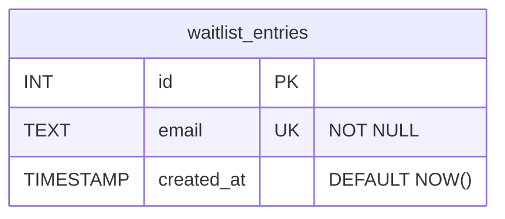

# System Patterns: Landscaping Waitlist Landing Page

## 1. Architecture Overview

The system will leverage the existing Remix application structure:

*   **Frontend (Client):** A Remix route (e.g., `_index.tsx` or a new dedicated route) will render the landing page using React, TypeScript, and Tailwind CSS. It will handle user input via a Remix `<Form>`.
*   **Backend (Remix Action):** A Remix `action` function within the same route file will process the form submission. It will validate the email and interact with the database using Prisma.
*   **Database:** A Postgres database hosted on Neon will store the waitlist email addresses.

```mermaid
graph TD
    User[User Browser] -- HTTP Request / Form Submission --> RemixApp[Remix Application on Vercel]
    RemixApp -- Renders Route Component --> Frontend[Landing Page UI (React/Tailwind)]
    RemixApp -- Processes Form via Action --> BackendLogic[Remix Action Function]
    BackendLogic -- Prisma Client Call --> Database[Neon Postgres DB]
    BackendLogic -- Returns ActionData --> RemixApp
    RemixApp -- Updates UI with Confirmation/Error --> Frontend
    Frontend -- Displays to --> User
```

## 2. Frontend Design

*   **Technology:** Remix (React, TypeScript).
*   **Styling:** Tailwind CSS, leveraging the existing setup (`tailwind.config.ts`, `app/tailwind.css`). A landscaping theme will be incorporated.
*   **Interactivity:** Remix `<Form>` component will handle submissions. Client-side validation can be added with JavaScript/HTML5 attributes, and server-side validation will occur in the Remix `action`.
    *   Displaying success or error messages to the user via Remix's `useActionData`.
    *   Displaying success or error messages to the user.

## 3. Backend Design

*   **Technology:** A Remix `action` function (Node.js runtime environment on Vercel). This is part of the Remix route module.
*   **API Endpoint:** Implicitly handled by the Remix route's `action` function when a form is POSTed to that route.
*   **Data Validation:** The Remix `action` will perform robust validation (e.g., ensure email is not empty, valid format).
*   **Database Interaction:** The Remix `action` will use the Prisma client to connect to the Neon Postgres database and insert the new email address.

## 4. Database Design

*   **Platform:** Neon (Serverless Postgres).
*   **Schema:** A single table, e.g., `waitlist_entries`.
    *   `id`: Primary Key, auto-incrementing integer or UUID.
    *   `email`: Text, unique, not null.
    *   `created_at`: Timestamp, default to current time.



## 5. Deployment Strategy

*   **Platform:** Vercel.
*   **Method:** Vercel CLI for deployments.
*   **Workflow:**
    1.  Develop locally.
    2.  Commit changes to a Git repository (recommended, though not strictly required for initial CLI deploy).
    3.  Use `vercel deploy` or `vercel --prod` to deploy to Vercel.
    4.  Configure environment variables on Vercel for the Neon database connection string.

## 6. Key Technical Decisions (Initial)

*   **Leverage Existing Remix Stack:** Utilize the full capabilities of the Remix framework for a cohesive and efficient development experience. This includes using Remix routes for UI, actions for backend logic, and integrating with Prisma.
*   **Prisma for Type-Safe DB Access:** Continue using Prisma for database interactions.
*   **Managed Database:** Use Neon for its serverless Postgres offering.
*   **Vercel Ecosystem:** Deploy the Remix application to Vercel, taking advantage of its seamless integration.
